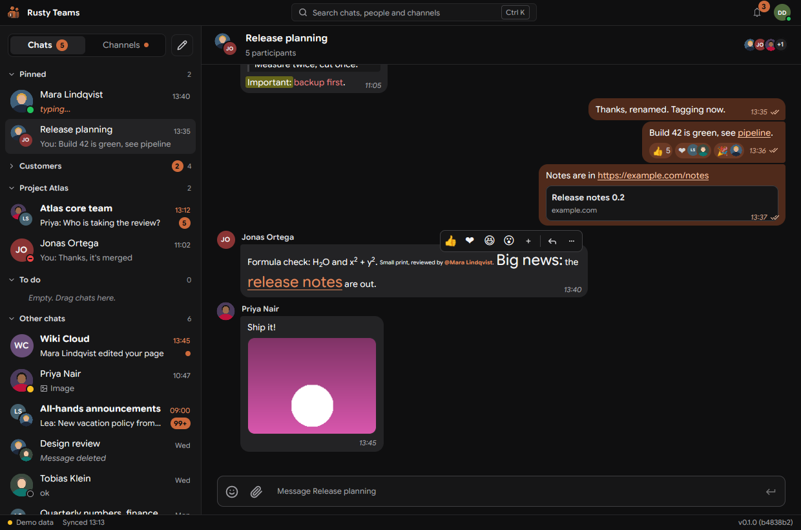

<div align="center">


# Rusty Teams

**A fast, native Microsoft Teams chat client. Written in Rust, rendered on the GPU. No admin approval needed.**

[](https://www.rust-lang.org/)
[](https://www.gpui.rs/)
[](#status)
[](LICENSE)

[Features](#features) · [Quick start](#quick-start) · [How it works](#how-it-works) · [Roadmap](ROADMAP.md)



</div>

> [!NOTE]
> Unofficial. Not affiliated with or endorsed by Microsoft. It uses the same web APIs as the Teams web app, which can change at any time.

## Why

| | Rusty Teams |
|---|---|
| 🏢 Works in company tenants | No app registration, no admin consent: it runs on the Teams web app your account is already allowed to use |
| ⚡ Starts instantly | Renders from a local SQLite cache before the network answers |
| 🔒 No tokens stored | Signs in through a real Teams web page; tokens never leave it |
| 📡 Live, no polling | Realtime socket pushes every change |
| 🔎 Offline search | Full-text index over your chats, `Ctrl+K` switcher |

## Features

**Chats and channels**
- Teams pin order, chat folders, hidden teams, Muted and Meeting chats sections
- Channel posts like Teams: one card per post, newest activity on top, last 3 replies, inline reply, new post with a subject, full conversation view
- Channel tabs and the Shared tab (library and files from posts), per-channel notifications
- Chat menu: pin, move to folder, mark as unread, mute, hide, leave
- Read receipts, typing indicator with faces, presence, unread jump
- Own status, status message and work location from the avatar menu; profile cards with org chart
- Activity bell: new messages, @mentions and reactions, kept for 14 days

**Messages**
- Send, edit, delete, react, quote-reply, @mentions
- Forward, copy link, save (Saved panel), pin to the chat banner, mark unread from here
- Inline images, file cards, link previews
- Adaptive Cards like Teams: tables, code blocks, badges, charts, date and time pickers, live refresh, task dialogs
- GIFs and stickers in messages
- Select and copy message text

**Composer**
- Rich text: format bar on selection, `Ctrl+B` / `Ctrl+I` / `Ctrl+U`, lists, quotes, code
- Markdown converts as you type or paste
- Picker with Emoji, GIF and Sticker tabs
- `:thumbsup:` and `:)` convert as you type, German aliases included
- Schedule send: right-click send or `Ctrl+Shift+Enter`
- Drafts and unsent messages survive a restart

**Calls**
- Test call to the Teams Echo bot from the avatar menu: native WebRTC audio, mute (`Ctrl+Shift+M`), device switching, mini window while you read other chats

**App**
- Dark theme, opens instantly from the cache
- Self-update from an update folder
- Single instance: a second start brings the window to the front

## Status

| Platform | State |
|---|---|
| 🪟 Windows | Main target. Login through an embedded WebView2 |
| 🐧 Linux | Connects to a Chrome started with `--remote-debugging-port=9222`. Built-in login is planned |

Calls, meetings and channel tabs are planned, see [ROADMAP.md](ROADMAP.md).

## Quick start

Try it with demo data, no account needed:

```bash
cargo run -p app -- --demo
```

| Task | Command |
|---|---|
| Against Chrome on a debug port | `cargo run -p app -- --endpoint http://127.0.0.1:9222` |
| Windows exe from WSL/Linux | `scripts/build-windows.sh crates/app teams` |
| Tests | `cargo test` |
| Headless screenshot (Xvfb, xdotool, xclip, mesa-vulkan-drivers) | `cargo build -p app && scripts/headless-shot.sh shot.png -- "mousemove 450 740" "click 1" "type hello"` |

## How it works

Rusty Teams never sees your password and never stores a token.
It signs you in through a real Teams web page and lets that page make the API calls.

```
+--------------------------- Rusty Teams (Rust) ---------------------------+
|  app      GPUI window: sidebar, chat view, composer, Ctrl+K              |
|  core     sync engine, actions, mapping to view models                   |
|  store    SQLite cache + FTS5 search index                               |
|  graph    Microsoft Graph: chats, channels, messages, people, sending    |
|  chatsvc  Teams chat service: realtime, pins, folders, read receipts     |
|  session  runs requests inside the Teams page, one Transport trait       |
+------------------------------------|-------------------------------------+
                                     | DevTools protocol (CDP)
+------------------------------------v-------------------------------------+
|  Hidden browser page on teams.cloud.microsoft, own profile               |
|  webview: WebView2 (Windows)   or   browser: Chrome with a debug port    |
+------------------------------------|-------------------------------------+
                                     | HTTPS with the page's own MSAL tokens
               Graph  |  chat service (ic3)  |  presence  |  Trouter socket
```

<details>
<summary><b>Sign-in and tokens</b></summary>

1. A hidden browser page loads Teams web with its own profile. On Windows this is WebView2, so single sign-on with the Windows account usually just works.
2. If Teams asks for a login, the login window shows itself. After that the page stays parked in the background.
3. Every API call is sent to that page over CDP. A small script (`crates/session/assets/fetch.js`) picks the matching token from the page's MSAL cache, refreshes it when needed, and runs the `fetch`.
4. Only the response goes back to Rust. Tokens never leave the page.

</details>

<details>
<summary><b>Data flow</b></summary>

| Step | What happens |
|---|---|
| Start | The UI renders from the SQLite cache right away. A chat still syncing shows a progress line in its header. Skeleton bubbles only when the cache has no messages yet |
| Sync | `core` fetches chats and channels from Graph with delta queries, pins and folders from the chat service |
| Live | `chatsvc` keeps the Trouter WebSocket open. An event only says "something changed", the content is then fetched fresh |
| Write | Sends, edits and reactions go out through Graph or the chat service, then the cache updates |
| Search | Local FTS5 index over cached messages, no server round trip |

</details>

<details>
<summary><b>Crates</b></summary>

| Crate | Job |
|---|---|
| `app` | GPUI desktop app, binary `teams` |
| `core` | Sync engine, actions, people ranking, markdown and card rendering |
| `store` | SQLite cache, migrations, search, image file cache |
| `graph` | Typed Microsoft Graph client with batching and paging |
| `chatsvc` | Teams chat service: Trouter realtime, pins, folders, receipts |
| `calling` | Native calls: Teams signaling, SDP translation, libwebrtc audio |
| `session` | `Transport` trait, CDP session, in-page fetch |
| `webview` | Hidden WebView2 host (Windows only) |
| `browser` | Chrome lifecycle and watchdog for the CDP transport |
| `cli` | `teams-probe`, a read-only end-to-end check |

</details>

## Roadmap

Open and finished features by priority: [ROADMAP.md](ROADMAP.md)

## License

[MIT](LICENSE)
